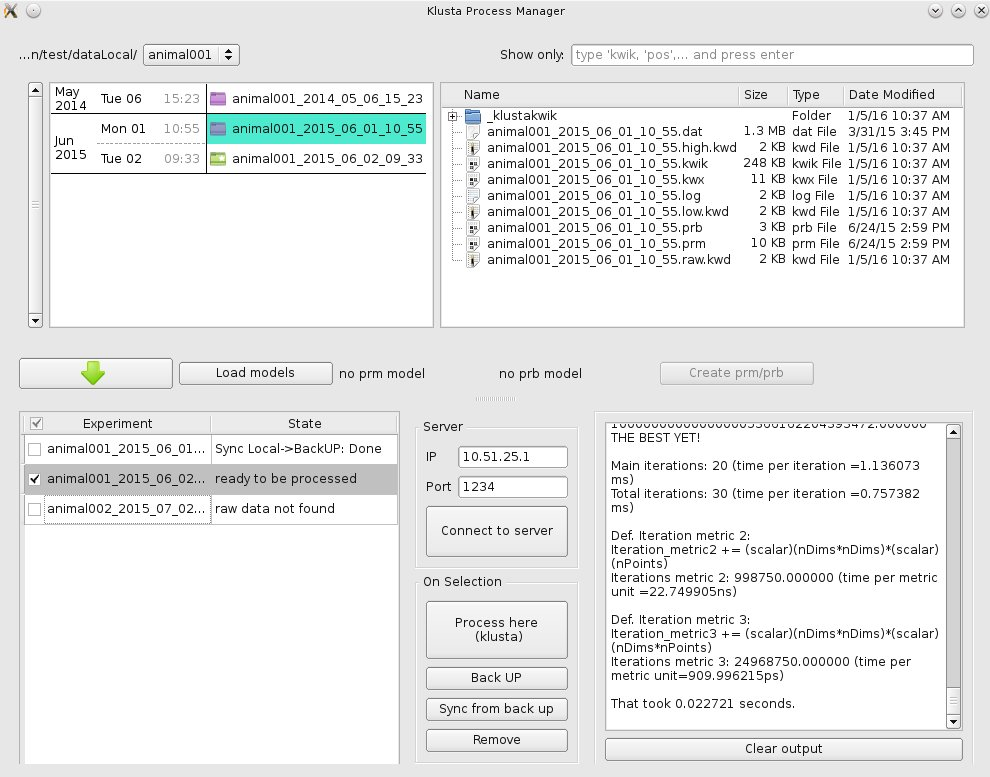

User interface around [Klusta suite](http://klusta-team.github.io/), an open-source software for neuroscience.

The application allows to:

  - easily browse through recording sessions
  - create parameter and probe files (.prm, .prb) from models, to be use with `klusta`
  - schedule a list of sessions to process with `klusta`, that can run eiter locally or on a remote computer
  - back up the data automatically before and after the processing

Requirements
------------
Python 3.4 and PyQt4
Should also work with Python 2.7

With Miniconda or Anaconda installed, do:

    conda update conda
    conda install pyqt

NB: the application has only been tested in Linux OpenSuse 13

Install
-------

1) Download source folder or clone the repository

    git clone https://github.com/tymoreau/klusta_process_manager.git
    cd klusta_process_manager

2) In a terminal, in the application's folder (where there is a setup.py file):

    python setup.py install
    sudo python create_shortcut.py

3) The install should have created a folder "processManager" in your home.
Inside, you'll find a file **userConfig.json** where you can **change the default
parameters**.

In this folder, the application is also going to save data in small .db or
.save files. If you encounter bugs, you can try to delete those files and
restart the application.
For now, a database (.db) is created for a given path_to_data and
path_to_back_up. An experimentListServer.save is created if you close the app
while processing experiments on the server.

To launch
-----

In a terminal, anywhere:

    > klusta_process_manager

Or through the shortcut in the menu All Applications > applications > klusta_process_manager   
NB: you can put a shortcut on the desktop, but not on the task bar ("show a launcher when not running" doesn't work)

If you have issues with 'Can not open ...x.db', check if you have the file 'libqsqlite.so' in anaconda/plugins/sqldrivers (or in miniconda/...). This file can be found in the 'other' folder of this app.

RSync
----

Synchronisation between local data and back-up is made with the command line tool *rsync*. 

By default, three different rsync lines:

- From local to back-up: `rsync -rlzutO`

- From back-up to local: `rsync -rlzutO --exlude=*dat`

- From back-up to computer server:

        rsync -rlzutO --prune-empty-dirs --include */ --include=*.prm --include=*.prb --include=*.dat --exclude=*

Server
------
Parameters in config.py  
PORT=1234  
IP=10.51.101.61  

To launch the server

    klusta_server
